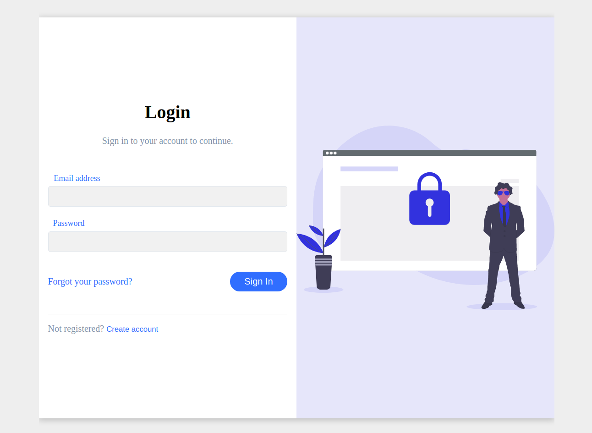

<h1 align="center">Simple Sign In/Up page using PHP</h1>

### Quick overview about myself
Hi:wave:

My name is **Mirodil Kamilov** who currently studies at Inha University in Tashkent in my *third year*. I am really passionate about learning web development in general. However, I have been actively learning PHP lately. So, in this repo, you will see my skills and knowledge as a **PHP developer**.

### Website overview

**This repository is hosted in <a href="https://optimus-registration.herokuapp.com" target="_blank">this link</a>, so you can see, test right now.** These are some **features** of this website:

- User can sign in/up
- Server-side validation
- Live search of user data (enabled by AJAX)
- Hashed user passwords

*Note: There is no middleware, so users can access certain paths without authentication.
UI was inspired by [(Brad) Traversy Media](https://www.youtube.com/watch?v=mUdo6w87rh4)*

### Showcase of myself
I hope, I can convince you to following statements by this simple website. I understand:

- Procedural PHP
- Object-Oriented PHP
- MVC pattern
- Working with database (retrieving/inserting data, prepared statements)
- AJAX
- HTML/CSS
